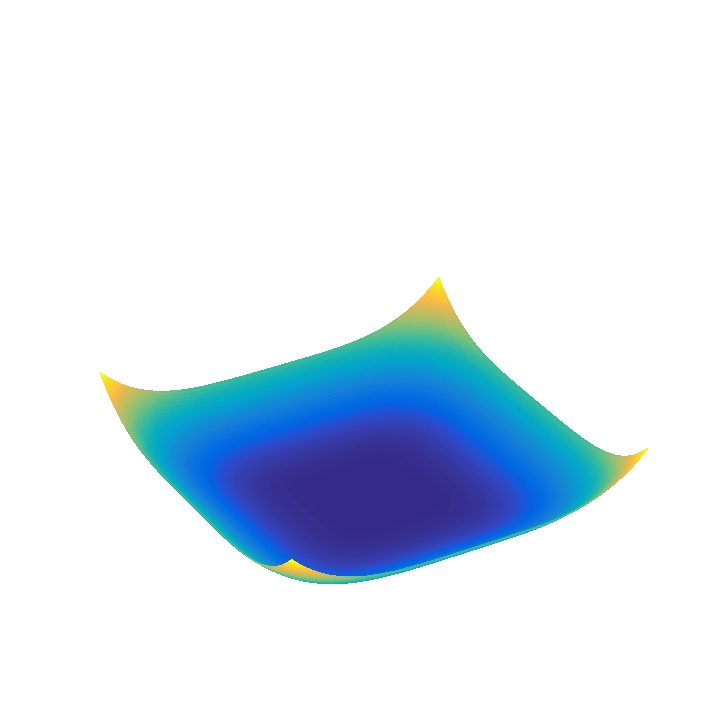
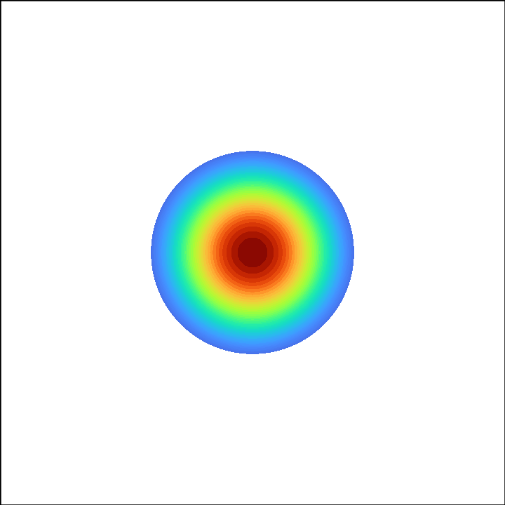
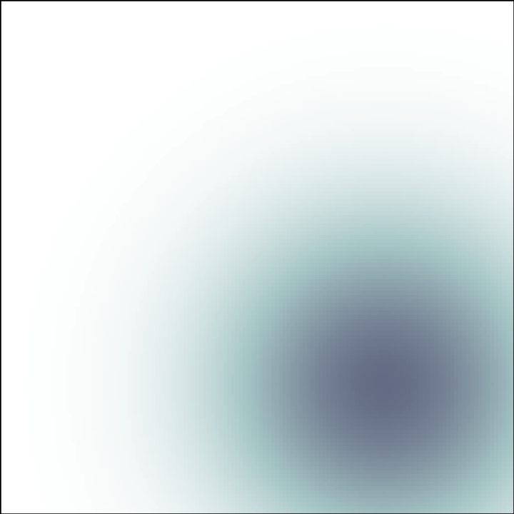
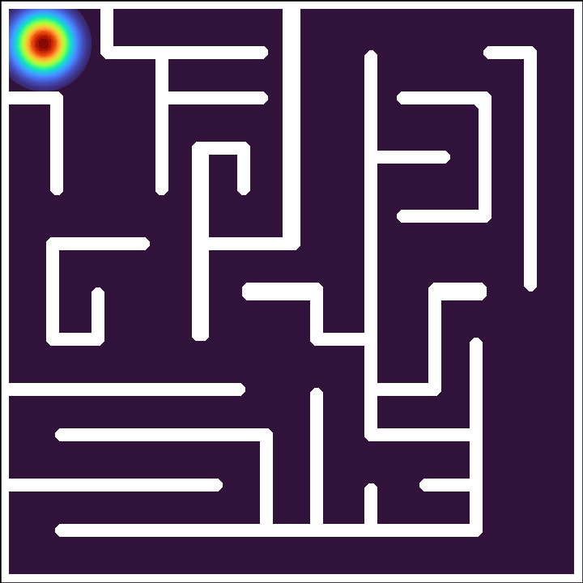

# DOTSOCP

  
  
  

  
  
  

**DOTSOCP** implements an efficient Second-Order Cone Programming (SOCP) approach for solving Dynamic Optimal Transport (DOT) on staggered grids.

This repository contains the official implementation of the paper:

> **An efficient second-order cone programming approach for dynamic optimal transport on staggered grid discretization**
> *Liang Chen, Youyicun Lin, and Yuxuan Zhou*
> arXiv:2505.05424, 2025.

## Implementations

We provide two independent implementations targeting different use cases:

### 1. [MATLAB Version](./matlab/)

> **Location:** [`./matlab/`](./matlab/)

The original codebase used for the numerical experiments in the paper.

* **Self-Contained Solvers**: Independent implementations for DOT 1D, DOT 2D, and Weighted DOT 2D.
* **Efficient Numerics**: Delivers fast execution with a low memory footprint.

### 2. [Python Version](./python/)

> **Location:** [`./python/`](./python/)

The **DOTSOCP-py** package, designed for versatility and comprehensive tooling.

* **Unified Solver**: A single, consistent implementation capable of solving DOT (1D/2D), Weighted DOT (2D) problems.
* **Rich Tooling**: Includes a Command Line Interface (CLI), Python API, and real-time visualization modules.

## Citation

If you use this code in your research, please cite:

* **Liang Chen, Youyicun Lin, and Yuxuan Zhou**, An efficient second-order cone programming approach for dynamic optimal transport on staggered grid discretization, arXiv:2505.05424, 2025.

## Contact

* E-mail: [chl@hnu.edu.cn](chl@hnu.edu.cn)
* Home page: [https://grzy.hnu.edu.cn/site/index/chenliang3](https://grzy.hnu.edu.cn/site/index/chenliang3)

## Copyright

**DOTSOCP** is distributed under the GNU Affero General Public License, version 3. See `LICENSE`.

---

Thank you for your interest in our work on Dynamic Optimal Transport. We hope this repository serves as a valuable resource for furthering research in this area.
